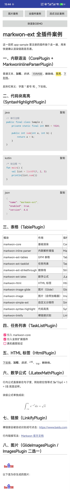

# app-sample（插件能力案例）

`app-sample` 是**插件全家桶**演示工程（Java，minSdk 16、multidex）：把 `markwon-ext` 仓库的所有插件装配进一个
`Markwon` 实例，逐一给出可点击的案例。**它回答的问题是「如何把插件全部接上」**；「如何在聊天里用
`markwon-block` 分块渲染」请看 [chat-demo](../chat-demo/README.md)。

两个页面：

| 页面 | 类 | 演示内容 |
| --- | --- | --- |
| 主页 | `MainActivity` | 图片 / 全插件 / 流式 SSE 三个案例 + 进入分块渲染演示页 |
| 分块渲染演示页 | `BlockDemoActivity` | `MarkdownTextBlockView`：整段渲染 / 流式打字机 / 明暗主题 |



---

## 1. 代码引入

仓库内调试（app-sample 依赖）：见 [app-sample/build.gradle](build.gradle)，核心即全部模块 `implementation project(':markwon-*')` + `prism4j`（高亮）+
`androidsvg / android-gif-drawable`（图片解码器）+ `multidex`。

外部使用方（按需挑模块，版本 `b7730ffa9f`）：

```gradle
repositories { maven { url 'https://jitpack.io' } }

dependencies {
    // 核心，必选
    implementation 'com.github.android-xiao-jun.markwon-ext:core:b7730ffa9f'

    // 按需引入（每个扩展都会自动带上 core）
    implementation 'com.github.android-xiao-jun.markwon-ext:ext-tables:b7730ffa9f'
    implementation 'com.github.android-xiao-jun.markwon-ext:ext-latex:b7730ffa9f'
    implementation 'com.github.android-xiao-jun.markwon-ext:ext-tasklist:b7730ffa9f'
    implementation 'com.github.android-xiao-jun.markwon-ext:ext-strikethrough:b7730ffa9f'
    implementation 'com.github.android-xiao-jun.markwon-ext:html:b7730ffa9f'
    implementation 'com.github.android-xiao-jun.markwon-ext:inline-parser:b7730ffa9f'
    implementation 'com.github.android-xiao-jun.markwon-ext:linkify:b7730ffa9f'
    implementation 'com.github.android-xiao-jun.markwon-ext:simple-ext:b7730ffa9f'
    implementation 'com.github.android-xiao-jun.markwon-ext:image:b7730ffa9f'
    implementation 'com.github.android-xiao-jun.markwon-ext:image-glide:b7730ffa9f'
    implementation 'com.github.android-xiao-jun.markwon-ext:syntax-highlight:b7730ffa9f'
    implementation 'com.github.android-xiao-jun.markwon-ext:recycler:b7730ffa9f'
    implementation 'com.github.android-xiao-jun.markwon-ext:recycler-table:b7730ffa9f'
    implementation 'com.github.android-xiao-jun.markwon-ext:editor:b7730ffa9f'
    implementation 'com.github.android-xiao-jun.markwon-ext:block:b7730ffa9f'
}
```

> `recycler` 与 `editor` 不是 `MarkwonPlugin`—— `recycler` 是 RecyclerView 适配层（`MarkwonAdapter`），
> `editor` 是编辑套件，二者不进 `builder.use(...)`，按需直接实例化使用。

---

## 2. 模块代码的使用

### 2.1 MainActivity：装配全插件（[MainActivity.java](src/main/java/io/noties/markwon/sample/MainActivity.java)）

`Markwon.builder` 默认已注册 `CorePlugin`，这里按顺序叠加其余插件（**主题必须最后注册**，
`MarkwonBuilderImpl` 按注册顺序累加 `configureTheme`，后注册覆盖先注册）：

```java
Markwon.Builder builder = Markwon.builder(context);
// 图片：Glide 方案（占位图 → Glide 真实 Drawable）或基础 ImagesPlugin
builder.usePlugin(createGlideImagesPlugin(requestManager));
builder
        .usePlugin(MarkwonInlineParserPlugin.create())                  // 内联解析器增强
        .usePlugin(HtmlPlugin.create())                                 // 原生 HTML
        .usePlugin(LinkifyPlugin.create())                              // URL 自动链接
        .usePlugin(StrikethroughPlugin.create())                        // ~~删除线~~
        .usePlugin(DefaultTheme.taskListPlugin(this))                   // - [x] 任务列表
        .usePlugin(TablePlugin.create(DefaultTheme.tableTheme(this)))   // GFM 表格（含横向滚动）
        .usePlugin(DefaultTheme.codeBlockScrollPlugin(this)             // 代码块滚动 + 复制按钮
                .onCodeBlockCopy((textView, code) -> { /* 剪贴板由宿主写 */ }))
        .usePlugin(DefaultTheme.simpleExtPlugin())                      // ==高亮== / ++下划线++
        .usePlugin(DefaultTheme.latexPlugin(this))                      // LaTeX 公式
        .usePlugin(SyntaxHighlightPlugin.create(                        // Prism4j 语法高亮
                new Prism4j(new SampleGrammarLocator()),
                DefaultTheme.syntaxTheme(),
                "java"))                                                // 未命中语言回退
        .usePlugin(DefaultTheme.markwonPlugin(this));                   // ★ 主题主装配（最后注册）
Markwon markwon = builder.build();
```

三个 raw 案例一键渲染：

```java
markwon.setMarkdown(textView, readRawText(R.raw.case_image));        // 图片案例（SVG/GIF/占位/失败）
markwon.setMarkdown(textView, readRawText(R.raw.case_all_plugins));  // 全部插件联调
// case_3.txt：流式 SSE 案例见 2.2
```

### 2.2 MainActivity：流式 SSE 增量解析（核心）

用 `MarkwonAppendState` 持有增量状态，每个 chunk 只重解析未稳定的尾部；结束时与整段解析结果做
byte-identical 校验（工作流标准动作，可复刻到自己的 SSE 工程）：

```java
MarkwonAppendState state = new MarkwonAppendState();
Spanned incremental = new SpannableStringBuilder();

// 每个 chunk 到达后：
incremental = markwon.appendMarkdown(state, chunk); // 增量解析（复用已稳定前缀）
markwon.setParsedMarkdown(textView, incremental);

// 流式结束后：
Spanned full = markwon.toMarkdown(fullSource);
boolean identical = full.toString().equals(incremental.toString()); // 校验一致
markwon.setParsedMarkdown(textView, full); // 收尾全量渲染，图片真正加载
```

### 2.3 BlockDemoActivity：MarkdownTextBlockView 一键接入（[BlockDemoActivity.java](src/main/java/io/noties/markwon/sample/BlockDemoActivity.java)）

布局：

```xml
<io.noties.markwon.block.view.MarkdownTextBlockView
    android:id="@+id/block_view"
    android:layout_width="match_parent"
    android:layout_height="wrap_content" />
```

代码：

```java
MarkdownTextBlockView blockView = findViewById(R.id.block_view);
blockView.setOnLinkClick(url -> Log.i(TAG, "link clicked: " + url));

blockView.renderMarkdown(readRawText(R.raw.case_block_demo)); // 场景1 整段渲染
blockView.appendMarkdown(chunk);                              // 场景2 流式打字机（逐 chunk）
blockView.setTheme(dark ? MdTheme.dark() : MdTheme.light());  // 场景3 明暗主题切换
blockView.renderMarkdown(blockView.getMarkdownText());        // 换主题后重渲染生效
```

---

## 3. 主题样式配置：只看 DefaultTheme 一处

[DefaultTheme.java](src/main/java/io/noties/markwon/sample/DefaultTheme.java) 是**样式唯一入口**，九节常量 +
工厂方法把「看默认值 / 改默认值」收敛到一个文件（注册顺序即 `use(...)` 顺序，后注册覆盖前注册）。

| 工厂方法 | 对应插件 / 主题 | 可自定义项 |
| --- | --- | --- |
| `markwonPlugin(Context)` | 主题主装配 | 正文/链接/代码块颜色、字距行距、引用条宽、标题字号梯度、横向滚动条样式 |
| `syntaxTheme()` | Prism4j 高亮 | 关键词/字符串/注释等配色（`SampleGrammarLocator` 自带 java/kotlin/groovy/json/xml 语法） |
| `tableTheme(Context)` | GFM 表格 | 表头底色、单元格 padding、边框 |
| `codeBlockScrollPlugin(Context)` | 代码块滚动 | 底部滚动条主题、横向滚动开关 |
| `codeBlockCopyTheme(Context)` | 代码块复制 | 复制按钮文案/背景/边框/圆角（`CodeBlockCopyTheme.Builder`） |
| `latexPlugin(Context)` | LaTeX | 公式字号、行内/块级开关 |
| `taskListPlugin(Context)` | 任务列表 | checkbox 图标 |
| `simpleExtPlugin()` | `==高亮==` / `++下划线++` | 高亮背景色 `MARK_HIGHLIGHT_COLOR` |
| `mdTheme()` / `markdownConfig()` / `applyBlockDefaults()` | markwon-block（第九节） | 块级渲染主题与开关；`applyBlockDefaults()` 已由 `SampleApp.onCreate` 调用 |

`SampleApp`（Application）只做一件事：

```java
DefaultTheme.applyBlockDefaults(); // 把第九节 mdTheme/markdownConfig 注入 MarkdownTextBlockView 全局默认
```

快捷键：**改任何样式 → 搜 DefaultTheme 对应常量 → 填自己的值**，无需碰插件装配代码。

---

## 4. 快速验证

1. **先开启模块**：确认根目录 `settings.gradle` 中包含 `include ':app-sample'`
   （默认已开启；被注释时取消注释，Gradle 同步后模块才会出现在 IDE）；
2. 项目根目录执行 `./gradlew :app-sample:assembleDebug`；
3. 安装：`adb install -r app-sample/build/outputs/apk/debug/app-sample-debug.apk`（本地构建产物）；
4. 主页：依次点「图片案例 / 全插件 / 流式 SSE」对照渲染效果；Logcat 过滤 `SSE` 看增量耗时与 `identical=true`；
5. 点「分块渲染演示」：整段 → 流式打字机 → 明暗主题三场景。

案例图见文档开头；APK 为本地构建产物（仓库 Git 不跟踪 `build/`）。

---

## 5. 模块覆盖

| markwon 模块 | 覆盖点 |
| --- | --- |
| core | 基础渲染、`appendMarkdown` 流式增量（SSE 案例） |
| block | `BlockDemoActivity` 整段/流式/主题三场景 |
| image / image-glide | 图片案例（SVG / GIF / 占位 / 失败态） |
| ext-tables / recycler-table | 表格渲染与横向滚动 |
| ext-latex | LaTeX 公式 |
| ext-strikethrough / ext-tasklist | 删除线 / 任务列表 |
| html / inline-parser / linkify / simple-ext | HTML、行内扩展、URL 链接、`==高亮==` |
| syntax-highlight | Prism4j 语法高亮（`SampleGrammarLocator`） |
| recycler / editor | 适配层与编辑套件（依赖已引，非插件装配） |