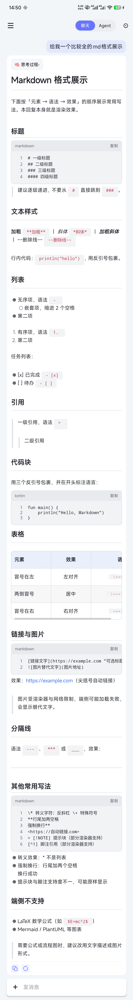
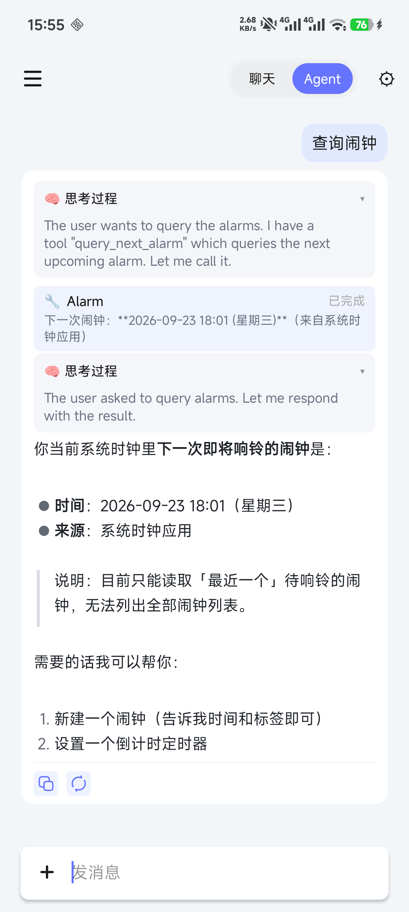
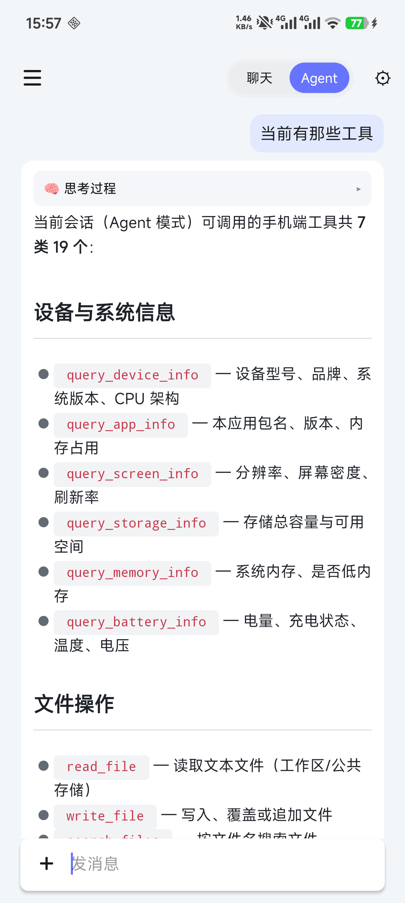
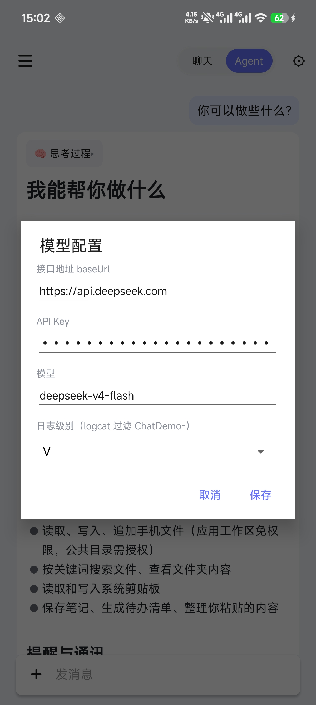

# chat-demo（AI 聊天案例：markwon-block 分块渲染 + appendMarkdown 流式打字机）

`chat-demo` 是个**可以跑起来的完整 AI 聊天 App**（Kotlin，minSdk 19，无需任何宿主的用户 / VIP / 云存储体系）：
OkHttp + Retrofit 直连 DeepSeek，SSE 流式输出，AI 回复交给 `MarkdownTextBlockView`（markwon-block）
**分块渲染 + 流式增量打字机**。它回答的问题是「`markwon-block` 在一线业务里怎么用」。



Agent 模式界面（思考 → 工具 → 回复 交替展示 / 工具清单）：

　

---

## 1. 功能一览

- 聊天 / Agent 双模式胶囊切换；右上角配置弹窗可切**模型 / baseUrl / 日志级别**（保存即生效）；
- AI 回复 Markdown 分块渲染：文本 / 代码 / 图片 / 分隔线各拆独立 View，流式 chunk 逐段淡入 + 光标打字机；
- 思考过程 + 工具调用按 `ChatTrailSegment` **有序交替**展示（多次 Agent 调用渲染多段思考，工具卡片原位更新）；
- DrawerLayout 侧滑会话历史：新建 / 切换 / 删除（二次确认），Room 持久化，**只存文件地址不存内容**；
- 附件：文本类（txt/md/json/kt/java 等 24 种白名单）读内容入参；二进制 / PDF 传占位说明；图片按模型选 Base64 多模态或占位；
- Agent 工具链：读/写/搜索文件、剪贴板、设备/存储/内存/电池/屏幕、联系人、蓝牙、闹钟/定时器、拨号、清缓存等，敏感工具 `ToolPermissionManager` 弹窗授权；
- 发送失败左红感叹号，AI 消息支持复制 / 重新生成。

---

## 2. 配置模型（两种方式）

### 2.1 方式一：local.properties（推荐，进库前只改一个文件）

`chat-demo/build.gradle` 在构建期从根目录 **`local.properties`** 读取三个 key 并注入 `BuildConfig`
（未配置时 App 内无法发起对话）：

```properties
# DeepSeek 官方网关（baseUrl 结尾不带 /）
ai.baseUrl = https://api.deepseek.com
ai.apiKey  = sk-xxxxx（换成你自己的密钥）
ai.model   = deepseek-v4-flash
```

| key | 含义 | 示例 |
| --- | --- | --- |
| `ai.baseUrl` | 模型网关地址（兼容 OpenAI 格式均可） | `https://api.deepseek.com` |
| `ai.apiKey` | 密钥 | `sk-xxx` |
| `ai.model` | 模型名 | `deepseek-v4-flash` |

### 2.2 方式二：App 内设置弹窗（运行时切换，免改配置重编）

聊天页**右上角齿轮**打开设置弹窗：baseUrl / apiKey / model 三个输入框，连同日志级别；
保存即生效，运行时**优先用面板里的值**覆盖 `BuildConfig`（适合切换模型对比效果；切换成支持视觉的网关后，
图片附件会自动走 Base64 多模态，DeepSeek 官方网关则降级为文本占位说明）。



---

## 3. 代码引入

仓库内调试（chat-demo 依赖）：

```gradle
implementation project(':markwon-core')
implementation project(':markwon-block')            // 分块渲染核心
implementation project(':markwon-ext-tables')       // 表格（block 渲染管线内置依赖）
implementation project(':markwon-ext-strikethrough')
implementation project(':markwon-ext-tasklist')
implementation project(':markwon-image')
implementation project(':markwon-html')
```

外部使用方的最小集合（版本 `b7730ffa9f`）：

```gradle
dependencies {
    implementation 'com.github.android-xiao-jun.markwon-ext:core:b7730ffa9f'
    implementation 'com.github.android-xiao-jun.markwon-ext:block:b7730ffa9f'  // 自动带上 core + ext-tables
}
```

网络 / 持久化 / 协程（按需复刻）：`OkHttp + Gson`（SSE 流式）、`Room 2.3.0`（会话与消息）、
`kotlinx-coroutines-android 1.4.2`。

---

## 4. 模块代码的使用

### 4.1 入口与页面骨架

- `ChatDemoApp`（Application）：仅初始化日志级别。
- `ChatActivity`（单 Activity）：中部消息列表、左侧会话抽屉、底部附件+输入、右上设置弹窗；
  因老版本 `activity/appcompat` 默认工厂走无参构造，`ChatViewModel` 必须显式用
  `ViewModelProvider.AndroidViewModelFactory(application)` 创建。

```kotlin
class ChatActivity : AppCompatActivity(), ChatViewModel.Callbacks, ToolPermissionManager.Delegate {
    private val viewModel: ChatViewModel by lazy {
        ViewModelProvider(this, ViewModelProvider.AndroidViewModelFactory(application))
            .get(ChatViewModel::class.java)
    }
    // onCreate: viewModel.callbacks = this; ToolPermissionManager.attach(this)
}
```

### 4.2 布局里引入分块渲染视图（核心）

AI 消息布局 `item_message_ai_text.xml`：白色气泡内 = 思考/工具轨迹动态容器 +
`MarkdownTextBlockView` + 反馈栏。

```xml
<io.noties.markwon.block.view.MarkdownTextBlockView
    android:id="@+id/ai_markdown_view"
    android:layout_width="match_parent"
    android:layout_height="wrap_content"
    android:layout_below="@id/ll_trail_container"
    android:visibility="gone" />
```

### 4.3 渲染调用（ChatAdapter）

```kotlin
private val markdownView: MarkdownTextBlockView = itemView.findViewById(R.id.ai_markdown_view)

// 链接点击：OnLinkClick 是 SAM（void onClick(String url)），直接 lambda
private val linkClickListener = OnLinkClick { url ->
    ctx.startActivity(Intent(Intent.ACTION_VIEW, Uri.parse(url)))
}
```

**场景 A：整段渲染**（历史消息 / 单次完整输出）

```kotlin
markdownView.renderMarkdown(item.content, linkClickListener)
```

**场景 B：流式增量**（SSE 每个 chunk 到达一次，打字机效果）

```kotlin
markdownView.visibility = View.VISIBLE
markdownView.appendMarkdown(delta, linkClickListener, true) // 第 3 参 streaming=true（新后缀淡入+光标）
```

增量只差分尾部：已渲染文本块复用，仅新增字符参与重排，规避全量 `setText` 的 StaticLayout 重建。
详情见 [markwon-block 模块文档](../markwon-block/README.md)。

### 4.4 思考 + 工具轨迹（ChatTrailSegment）

`ChatMessageItem` 持有有序轨迹 `trail: MutableList<ChatTrailSegment>`（sealed class，定义于
`viewmodel/ChatMessageItem.kt`，两子类：`Thinking(text)` / `Tools(steps: List<AgentStep>)`）：

```kotlin
item.trailAppendThinking(chunk)   // 尾部已是 Thinking 段则直接追加，否则新建一段（天然按轮次分段）
item.trailTools()                 // 工具段：steps 内追加 / 原位更新 AgentStep 状态
```

`ChatAdapter` 按段在 `ll_trail_container` 动态挂载「思考面板（`MaxHeightNestedScrollView` 内部滚动
优先消费）」与「工具卡片」，工具执行结果**原位更新卡片、不重建思考段** —— 多轮 Agent 输出顺序与模型一致。

### 4.5 SSE 网络链路

```
ChatViewModel → DeepSeekAIService(构造请求体@IO线程) → OkHttpStreamClient(流式读取)
              → SSEStreamParser(按事件分割) → 回调 onDelta/onThinking/onTool/onDone
```

- 请求体构造（含附件 Base64 / 文件读取）一律 `withContext(Dispatchers.IO)`，避免主线程卡顿；
- 图片 + DeepSeek 官方网关 → 文本占位说明（官方不支持 image_url）；兼容网关 → Base64 多模态；
- 流式正文 chunk 走 4.3 的 `appendMarkdown`，思考 / 工具 call 走 `ChatTrailSegment`。

### 4.6 Room 本地持久化

`SessionEntity`（会话：标题 / 时间）+ `MessageEntity`（消息：角色 / 正文 / 附件地址 / 状态 /
轨迹 JSON），`Converters` 处理 List 序列化；**附件只存本地文件路径，不存内容**。

### 4.7 Agent 工具与权限

`ToolRegistry` 注册全部 `ChatTool`；`ToolPermissionManager` 拦截敏感工具（通讯录 / 蓝牙等）：
说明用途弹窗 → 系统授权 → 永久拒绝时引导设置页并可复查（`ChatActivity` 实现其 `Delegate`）。

---

## 5. 主题样式配置

chat-demo **未做任何自定义**，全程使用 markwon-block 默认（`MdTheme.light()` + 默认
`MarkdownConfig` + 内置 `Markwon` 管线）。需要微调时：

| 诉求 | 做法 |
| --- | --- |
| 改全局观感（颜色 / 开关） | 复刻 `app-sample` 的 [DefaultTheme 第九节](../app-sample/README.md) 快照，`Application.onCreate` 调 `MarkdownTextBlockView.setDefaultTheme / setDefaultConfig` 一次即可 |
| 只改单个消息视图 | `markdownView.setTheme(MdTheme.dark())`、`markdownView.setConfig(MarkdownConfig.Builder()...)` |
| 换整套解析管线 | `MarkdownTextBlockView.setMarkdownFactory { ctx, theme, config -> ... }`（注意管线需含表格插件） |
| 暗色聊天背景 | 直接 `MdTheme.dark()`（内置预设） |

`MdTheme.light()` 全部默认值与每个开关的说明见 [markwon-block README 第 4 节](../markwon-block/README.md#4-主题样式配置)。

---

## 6. 工程结构

```
chat-demo/src/main/java/io/noties/markwon/chatdemo/
├── ChatDemoApp.kt            # Application
├── ui/                       # ChatActivity / ChatAdapter / SessionAdapter / ThinkingDotsView …
├── viewmodel/                # ChatViewModel（衔接 UI 与 service/repository）
│                             #   + ChatMessageItem（含 sealed class ChatTrailSegment: Thinking/Tools）
├── service/                  # DeepSeekAIService / OkHttpStreamClient / SSEStreamParser
│                             #   / IAIService / OpenAIMessageBuilder（附件→消息内容）
├── repository/               # ChatRoomRepository（Room 封装）
├── room/                     # SessionDao / MessageDao / SessionEntity / MessageEntity / Converters
├── bean/                     # AIChatMessage / Attachment / AgentStep / SessionSummary
├── tool/                     # ToolRegistry + 各 ChatTool + ToolPermissionManager + ToolPaths
└── util/                     # AppLog / FileHelper（附件选择：文件请求码 1101/1102）/ ClipboardCompat
```

---

## 7. 快速验证

1. **先开启模块**：确认根目录 `settings.gradle` 中包含 `include ':chat-demo'`
   （默认已开启；被注释时取消注释，Gradle 同步后模块才会出现在 IDE）；
2. 根目录 `local.properties` 写入 `ai.baseUrl / ai.apiKey / ai.model`（见 [第 2 节](#2-配置模型两种方式)）；
3. `./gradlew :chat-demo:assembleDebug` → `adb install -r chat-demo/build/outputs/apk/debug/chat-demo-debug.apk`
   （本地构建产物，Git 不跟踪 `build/`）；
4. 验证点：SSE 打字机与思考/工具交替顺序；历史会话重进（整段 `renderMarkdown` 回放）；
   发送 .txt/.md 附件、DeepSeek 官方模型发图片（占位说明）、切换视觉网关发图片（Base64）；
   Agent 触发敏感工具看授权弹窗；发送失败红叹号与复制/重新生成。